# 1. Giới thiệu (Introduction)

## 1.1. Bối cảnh

Trong kỷ nguyên bùng nổ thông tin số, khối lượng dữ liệu văn bản được tạo ra mỗi ngày trên Internet là vô cùng lớn, từ các bài đăng trên mạng xã hội, đánh giá sản phẩm, bình luận tin tức, đến các diễn đàn thảo luận. Dữ liệu này chứa đựng vô vàn ý kiến, quan điểm và cảm xúc của con người, trở thành một nguồn tài nguyên quý giá cho các tổ chức và cá nhân muốn thấu hiểu thị trường, khách hàng và dư luận xã hội. Tuy nhiên, việc khai thác thủ công nguồn dữ liệu khổng lồ này là bất khả thi. Đây là lúc Xử lý Ngôn ngữ Tự nhiên (Natural Language Processing - NLP) phát huy vai trò của mình, và một trong những nhiệm vụ cốt lõi và có ứng dụng rộng rãi nhất chính là **Phân tích Cảm xúc** (Sentiment Analysis), hay còn gọi là Opinion Mining.

**Phân tích Cảm xúc** là một lĩnh vực thuộc NLP tập trung vào việc sử dụng các kỹ thuật tính toán để xác định, trích xuất, định lượng và nghiên cứu các trạng thái tình cảm và thông tin chủ quan trong dữ liệu văn bản. Nói một cách đơn giản, mục tiêu chính của phân tích cảm xúc là phân loại một đoạn văn bản (ví dụ: một câu, một đoạn, một tài liệu) thể hiện quan điểm tích cực (positive), tiêu cực (negative) hay trung tính (neutral). Trong nhiều trường hợp, bài toán có thể phức tạp hơn, bao gồm việc xác định các cung bậc cảm xúc khác nhau (ví dụ: vui, buồn, tức giận) hoặc xác định cảm xúc đối với các khía cạnh cụ thể (Aspect-Based Sentiment Analysis).

Tầm quan trọng của phân tích cảm xúc trong NLP và các lĩnh vực khác là không thể phủ nhận. Nó cung cấp khả năng tự động hóa quá trình đọc và hiểu cảm xúc của con người ở quy mô lớn, điều mà trước đây đòi hỏi rất nhiều thời gian và công sức. Các ứng dụng thực tế của phân tích cảm xúc vô cùng đa dạng và có tác động sâu sắc:

* **Kinh doanh và Marketing:** Theo dõi phản hồi của khách hàng về sản phẩm/dịch vụ trên mạng xã hội và các trang đánh giá, phân tích hiệu quả chiến dịch marketing, nghiên cứu thị trường, quản lý thương hiệu và danh tiếng.
* **Chính trị và Xã hội:** Nắm bắt dư luận về các chính sách, ứng cử viên chính trị, các sự kiện xã hội; phát hiện tin giả và các chiến dịch tuyên truyền tiêu cực.
* **Chăm sóc khách hàng:** Tự động phân loại và ưu tiên các phản hồi khẩn cấp hoặc tiêu cực của khách hàng, cải thiện chất lượng dịch vụ.
* **Tài chính:** Phân tích tin tức và các bài viết trên mạng xã hội để dự đoán biến động thị trường chứng khoán.
* **Nghiên cứu khoa học xã hội:** Phân tích cảm xúc trong các văn bản lịch sử, văn học hoặc khảo sát quy mô lớn.

Với sự phát triển không ngừng của các kỹ thuật học máy (Machine Learning) và đặc biệt là học sâu (Deep Learning), lĩnh vực phân tích cảm xúc đã chứng kiến những bước tiến vượt bậc trong những năm gần đây. Nhiều phương pháp và mô hình mới liên tục được đề xuất, từ các cách tiếp cận dựa trên từ điển, các mô hình ML truyền thống như Naive Bayes, SVM, đến các kiến trúc mạng nơ-ron phức tạp như CNN, RNN (LSTM, GRU), và gần đây nhất là sự thống trị của các mô hình dựa trên kiến trúc Transformer (BERT, RoBERTa, etc.). Mỗi phương pháp đều có những ưu điểm, hạn chế và phù hợp với các ngữ cảnh khác nhau.

Do đó, việc thực hiện một **khảo sát toàn diện về các phương pháp phân tích cảm xúc hiện có** là vô cùng cần thiết. Một bài khảo sát như vậy không chỉ giúp hệ thống hóa kiến thức, tổng hợp các kỹ thuật đã được phát triển, mà còn cung cấp một cái nhìn sâu sắc về hiệu quả, ưu nhược điểm của từng phương pháp. Nó giúp các nhà nghiên cứu mới nhanh chóng nắm bắt được tình hình lĩnh vực, đồng thời hỗ trợ các nhà nghiên cứu và kỹ sư có kinh nghiệm trong việc lựa chọn phương pháp phù hợp nhất cho bài toán cụ thể của họ, xác định những thách thức còn tồn tại và định hướng cho các nghiên cứu trong tương lai. Bài khảo sát này tập trung vào việc đánh giá các phương pháp trên một tập dữ liệu chuẩn mực và phổ biến là IMDB Movie Reviews, nhằm cung cấp một cơ sở so sánh khách quan và hữu ích.

## 1.2. Tập dữ liệu IMDB 50K Movie Reviews

Để đánh giá và so sánh hiệu quả của các phương pháp phân tích cảm xúc một cách công bằng, việc sử dụng một tập dữ liệu chuẩn hóa (benchmark dataset) là rất quan trọng. Trong lĩnh vực này, **IMDb 50K Movie Reviews** (thường được gọi tắt là IMDb dataset) nổi lên như một bộ dữ liệu tiêu chuẩn và được sử dụng rộng rãi bậc nhất [1].

Bộ dữ liệu này bao gồm **50.000 bài đánh giá phim (movie reviews)** được thu thập từ trang web Internet Movie Database (IMDb) [1]. Mỗi bài đánh giá được gán nhãn cảm xúc nhị phân rõ ràng: **"pos"** cho các đánh giá thể hiện cảm xúc tích cực và **"neg"** cho các đánh giá thể hiện cảm xúc tiêu cực. Đây là một tập dữ liệu quy mô lớn, cung cấp đủ dữ liệu cho việc huấn luyện và đánh giá các mô hình, đặc biệt là các mô hình học sâu đòi hỏi lượng dữ liệu đáng kể.

Một trong những điểm mạnh của IMDb dataset nằm ở **cấu trúc phân chia rõ ràng và cân bằng** của nó [1]. Bộ dữ liệu được chia thành hai tập riêng biệt:
* **Tập huấn luyện (train set):** Gồm 25.000 bài đánh giá.
* **Tập kiểm tra (test set):** Gồm 25.000 bài đánh giá còn lại.

Quan trọng hơn, cả hai tập này đều đảm bảo **sự cân bằng hoàn hảo giữa các nhãn cảm xúc**: mỗi tập chứa đúng 12.500 đánh giá tích cực và 12.500 đánh giá tiêu cực [1]. Sự cân bằng này giúp tránh được tình trạng thiên lệch dữ liệu (data bias) trong quá trình huấn luyện, cho phép các mô hình học được đặc trưng của cả hai lớp cảm xúc một cách công bằng và giúp việc đánh giá hiệu suất phân loại trên tập kiểm tra trở nên khách quan hơn.

Ngoài quy mô và cấu trúc tốt, IMDb dataset còn sở hữu những **đặc điểm nổi bật** khiến nó trở thành một thử thách thú vị và thực tế cho các mô hình NLP:

1.  **Độ dài văn bản đa dạng:** Các bài đánh giá có độ dài rất khác nhau, từ những câu nhận xét ngắn gọn vài chục từ đến những bài phân tích sâu dài hàng nghìn từ [1]. Điều này đòi hỏi mô hình phải có khả năng xử lý hiệu quả các chuỗi văn bản với độ dài biến thiên lớn.
2.  **Tính phức tạp về ngôn ngữ:** Văn bản đánh giá phim thường chứa đựng nhiều yếu tố ngôn ngữ phức tạp như cách diễn đạt mỉa mai (sarcasm), từ ngữ đa nghĩa (ambiguity), các cấu trúc câu phức tạp, và sự pha trộn giữa mô tả nội dung phim và thể hiện cảm xúc cá nhân [1]. Đây là những thách thức lớn đối với các mô hình NLP trong việc nắm bắt chính xác ý định và cảm xúc thực sự của người viết.
3.  **Tính ứng dụng cao:** Mặc dù được xây dựng chủ yếu cho bài toán phân loại cảm xúc, IMDb dataset còn được sử dụng trong nhiều nghiên cứu về các tác vụ NLP khác như tóm tắt văn bản (text summarization), sinh ngôn ngữ tự nhiên (natural language generation), hay phân loại chủ đề (topic classification) [1].
4.  **Hỗ trợ từ các thư viện:** Sự phổ biến của IMDb dataset được thể hiện qua việc nó được tích hợp sẵn trong nhiều thư viện học máy và NLP thông dụng như TensorFlow Datasets, PyTorch (thông qua `torchtext` hoặc các wrapper khác), Hugging Face Datasets. Điều này giúp các nhà nghiên cứu dễ dàng truy cập, tải về và tiền xử lý dữ liệu một cách nhanh chóng và thuận tiện.

Chính vì những đặc điểm trên, IMDb 50K Movie Reviews đã trở thành một bộ dữ liệu không thể thiếu để đánh giá và so sánh các phương pháp phân tích cảm xúc, thúc đẩy sự phát triển của lĩnh vực này. Việc khảo sát các phương pháp được áp dụng trên tập dữ liệu này sẽ cung cấp những hiểu biết giá trị về hiệu quả và giới hạn của chúng trong việc xử lý ngôn ngữ tự nhiên thực tế.

## 1.3. Mục tiêu và Phạm vi Khảo sát

Với bối cảnh và tầm quan trọng của phân tích cảm xúc cũng như vai trò của tập dữ liệu IMDb 50K, bài khảo sát này được thực hiện với các **mục tiêu chính** sau đây:

1.  **Tổng hợp và hệ thống hóa:** Tập hợp và trình bày một cách có hệ thống các phương pháp và kỹ thuật tiêu biểu đã được áp dụng cho bài toán phân tích cảm xúc, từ các phương pháp Machine Learning truyền thống đến các mô hình Deep Learning và Transformer hiện đại.
2.  **So sánh hiệu quả:** Cung cấp một cái nhìn tổng quan về hiệu suất (thường được đo bằng độ chính xác - accuracy) của các phương pháp khác nhau khi được đánh giá trên cùng một tập dữ liệu chuẩn là IMDb 50K, từ đó đưa ra những so sánh tương đối về mặt hiệu quả.
3.  **Phân tích ưu nhược điểm:** Đi sâu vào phân tích nguyên lý hoạt động, ưu điểm và hạn chế của từng nhóm phương pháp hoặc các mô hình cụ thể, làm rõ những bối cảnh hoặc loại dữ liệu mà chúng hoạt động tốt hoặc chưa tốt.
4.  **Xác định xu hướng phát triển:** Nhận diện các xu hướng chính trong lĩnh vực, chẳng hạn như sự chuyển dịch từ các phương pháp truyền thống sang học sâu, vai trò ngày càng tăng của các mô hình pre-trained lớn (như Transformer), và tiềm năng của các kỹ thuật như Attention hay Ensemble Learning.
5.  **Đề xuất hướng nghiên cứu:** Dựa trên những phân tích và kết quả tổng hợp, xác định những thách thức còn tồn tại và đề xuất các hướng nghiên cứu tiềm năng trong tương lai để tiếp tục cải thiện hiệu quả và khả năng ứng dụng của các mô hình phân tích cảm xúc.

Để đảm bảo tính tập trung và khả năng so sánh trực tiếp giữa các nghiên cứu, **phạm vi của bài khảo sát** này được giới hạn như sau:

* **Tập dữ liệu:** Chúng tôi chủ yếu tập trung vào các công trình nghiên cứu đã công bố kết quả thực nghiệm trên **tập dữ liệu IMDb 50K Movie Reviews**. Việc giới hạn phạm vi vào một bộ dữ liệu chuẩn duy nhất giúp đảm bảo tính nhất quán và cho phép so sánh hiệu suất giữa các phương pháp một cách có ý nghĩa hơn.
* **Bài toán:** Khảo sát tập trung vào bài toán **phân loại cảm xúc nhị phân (tích cực/tiêu cực)** trên tập dữ liệu IMDb, vì đây là thiết lập phổ biến nhất được sử dụng trong các nghiên cứu liên quan đến bộ dữ liệu này.

Thông qua việc thực hiện các mục tiêu trong phạm vi đã xác định, chúng tôi hy vọng bài khảo sát này sẽ mang lại một tài liệu tham khảo hữu ích và cập nhật cho cộng đồng nghiên cứu và ứng dụng NLP quan tâm đến lĩnh vực phân tích cảm xúc.

# 2. Tổng quan các phương pháp (Literature Review / Methodologies Overview)

Phần này trình bày tổng quan về các phương pháp tiếp cận khác nhau đã được đề xuất và đánh giá cho bài toán phân tích cảm xúc trên tập dữ liệu IMDb 50K Movie Reviews. Các phương pháp này trải dài từ các kỹ thuật Machine Learning (ML) truyền thống, các kiến trúc Deep Learning (DL) đa dạng, cho đến các mô hình Transformer mạnh mẽ và các kỹ thuật Ensemble Learning nhằm kết hợp ưu điểm của nhiều mô hình.

Để cung cấp một cái nhìn so sánh ban đầu về hiệu quả của các hướng tiếp cận này, Bảng 1 dưới đây tóm tắt một số phương pháp tiêu biểu cùng với kết quả độ chính xác (Accuracy) được báo cáo trên tập kiểm tra của IMDb. Bảng bao gồm thông tin về nhóm phương pháp, mô hình/kỹ thuật cụ thể được sử dụng, loại đặc trưng hoặc biểu diễn đầu vào chính, độ chính xác đạt được, và nguồn tài liệu tham khảo.

**Bảng 1: Tổng hợp các phương pháp phân tích cảm xúc trên tập dữ liệu IMDb 50K**

| Phương pháp             | Mô hình/Kỹ thuật cụ thể             | Đặc trưng / Biểu diễn đầu vào                    | Độ chính xác (%) | Nguồn (Tác giả, Năm)                                  |
| :-------------------- | :----------------------------------------- | :----------------------------------------------- | :--------------- | :---------------------------------------------------- |
| Machine Learning      | Naive Bayes, SVM, Maximum Entropy        | Unigram, Bigram (sau tiền xử lý)                  | 88.00            | Iqbal et al. (2018) [2]                             |
| Deep Learning         | CNN                                        | Count Vectorizer (sau tiền xử lý)                 | 99.33* | Dholpuria et al. (2018) [3]                           |
| Deep Learning         | 1D-CNN + GRU                               | (Thường là Word Embeddings)                       | 90.02            | Thinh et al. (2019) [4]                             |
| Deep Learning         | Hybrid CNN + BiLSTM + Attention          | Word Embeddings (word2vec)                        | 90.26            | Jang et al. (2020) [5]                              |
| Deep Learning         | DV-ngrams-cosine + Logistic Regression   | Document Vectors (huấn luyện với cosine, n-grams) | 93.13 (Đã sửa lỗi) | Thongtan & Phienthrakul (2019) [7] / Zhang & Arefyev (2022) [6] |
| Transformer           | RoBERTa-large (fine-tuned)               | RoBERTa Embeddings                                | 96.56            | Zhang & Arefyev (2022) [6]                            |
| Transformer           | BERT-based CBRNN                           | BERT Embeddings                                   | 93.00            | Kokab et al. (2022) [8]                             |
| Transformer           | RoBERTa-LSTM                               | RoBERTa Embeddings                                | 92.96            | Tan et al. (2022a) [9]                              |
| Ensemble Learning     | DV-ngrams-cosine + NB-weighted BON       | Document Vectors + Bag-of-N-grams (NB weighted)   | 97.42 (Báo cáo gốc)   **93.68 (Đã sửa lỗi)** | Thongtan & Phienthrakul (2019) [7] / Zhang & Arefyev (2022) [6] |
| Ensemble Learning     | RoBERTa-LSTM + RoBERTa-BiLSTM + RoBERTa-GRU | RoBERTa Embeddings                                | 94.90            | Tan et al. (2022b) [10]                             |
| Graph Neural Network | ST-GCN                                     | Biểu diễn đồ thị từ văn bản                      | 94.94            | AlBadani et al. (2022) [11]                           |

*Lưu ý: Kết quả 99.33% của Dholpuria et al. (2018) [3] sử dụng CNN rất cao so với các phương pháp khác và có thể cần xem xét kỹ hơn về điều kiện thực nghiệm hoặc phương pháp đánh giá.*

Bảng tổng hợp này cho thấy sự đa dạng trong các phương pháp tiếp cận và sự cải thiện đáng kể về hiệu suất theo thời gian, đặc biệt là với sự ra đời của các mô hình Transformer và Ensemble. Các phần tiếp theo sẽ đi sâu vào phân tích chi tiết hơn về từng nhóm phương pháp này.

## 2.1. Phương pháp Machine Learning (ML) truyền thống

* **Mô tả chung:** Sử dụng thuật toán cổ điển và trích xuất đặc trưng thủ công.
* **Các thuật toán phổ biến:**
    *Các thuật toán phổ biến:**
    * Naive Bayes
      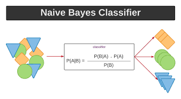
    * SVM (Support Vector Machines)
      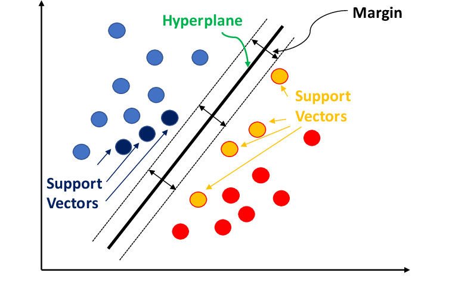
    * Maximum Entropy
      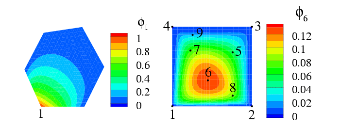
* **Kỹ thuật tiền xử lý và trích xuất đặc trưng:**
   * Tokenization
      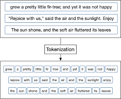
    * Lemmatization
      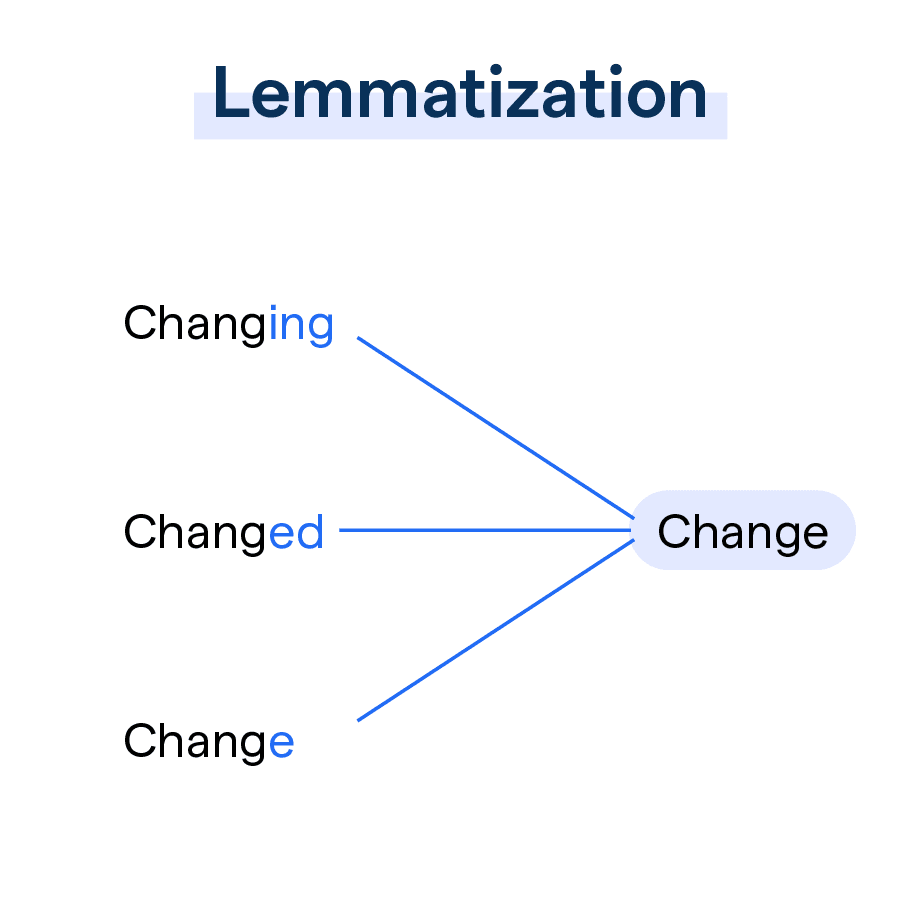
    * Unigram & Bigram
      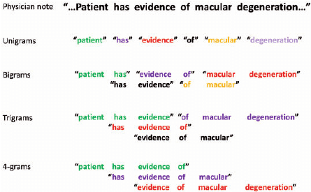
    * TF-IDF
      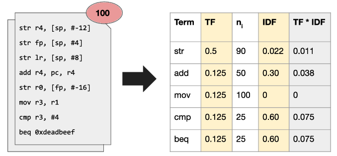
* **Ví dụ và kết quả:**
    * Iqbal et al. (2018) đạt độ chính xác 88% [2].
* **Đánh giá:**
    * **Ưu điểm:** Tương đối đơn giản để triển khai.
    * **Nhược điểm:**
        * Hiệu quả thường thấp hơn các phương pháp hiện đại.
        * Đòi hỏi kỹ thuật trích xuất đặc trưng thủ công (feature engineering), tốn thời gian và cần kiến thức chuyên môn.

## 2.2. Phương pháp Deep Learning (DL)

### 2.2.1. Mạng Nơ-ron Tích chập (CNN - Convolutional Neural Networks)
 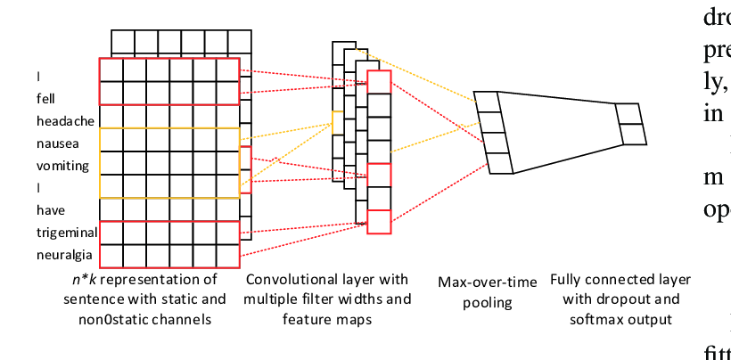
* **Nguyên lý:** Sử dụng các bộ lọc (kernels) để trượt qua dữ liệu đầu vào (ví dụ: ma trận word embedding của câu) nhằm **trích xuất đặc trưng cục bộ (local features)**, chẳng hạn như các cụm từ quan trọng, bất kể vị trí của chúng trong câu.
* **Ví dụ và kết quả:** Dholpuria et al. (2018) đã áp dụng CNN, kết hợp với kỹ thuật **Count Vectorizer** (sau khi loại bỏ ký tự đặc biệt và stop words), và báo cáo đạt độ chính xác **99.33%** [3]. *(Lưu ý: Kết quả này đặc biệt cao, cần xem xét kỹ lưỡng bối cảnh thực nghiệm, bộ dữ liệu và phương pháp đánh giá được sử dụng trong nghiên cứu đó).*

### 2.2.2. Mạng Nơ-ron Hồi quy (RNN - Recurrent Neural Networks)
 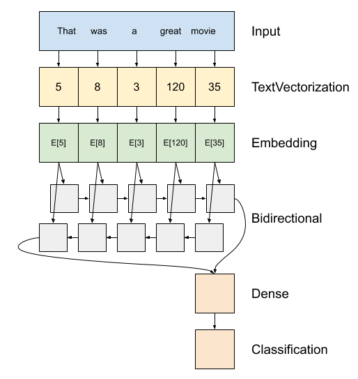
* **Nguyên lý:** Được thiết kế để **xử lý dữ liệu tuần tự (sequential data)** như ngôn ngữ tự nhiên. RNN có khả năng duy trì "bộ nhớ" về thông tin từ các bước trước đó trong chuỗi, giúp **nắm bắt các phụ thuộc ngữ cảnh dài hơn** trong câu [12].
* **Các biến thể phổ biến:** Do RNN cơ bản gặp vấn đề về vanishing/exploding gradients, các biến thể phức tạp hơn thường được sử dụng:
    * LSTM (Long Short-Term Memory) [12]
    * GRU (Gated Recurrent Unit) [13]
    * BiLSTM (Bidirectional LSTM - xử lý chuỗi theo cả hai chiều xuôi và ngược)
    * BiGRU (Bidirectional GRU)
* **Ví dụ và kết quả:** Thinh et al. (2019) đã đề xuất một kiến trúc kết hợp **1D-CNN và GRU**, đạt được độ chính xác **90.02%** [4].

### 2.2.3. Mô hình Lai (Hybrid Models)
 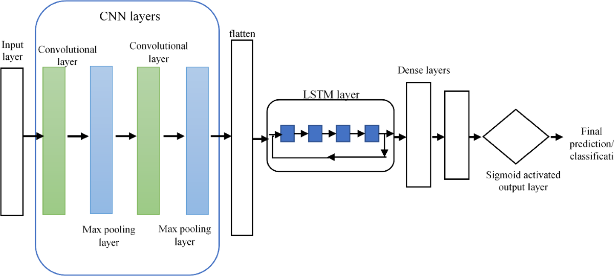

* **Khái niệm:** Các mô hình này kết hợp nhiều kiến trúc Deep Learning khác nhau, thường là **CNN và RNN (hoặc các biến thể như LSTM/GRU)**, nhằm tận dụng điểm mạnh của từng loại để cải thiện hiệu suất tổng thể.
* **Ví dụ điển hình:** Mô hình "Hybrid CNN + BiLSTM with Attention" được đề xuất bởi **Jang et al. (2020)**, đạt độ chính xác **90.26%** [5].
* **Kiến trúc cụ thể (Jang et al., 2020) [5]:**
    * Luồng xử lý: `Word2vec -> CNN -> BiLSTM -> Attention -> Fully Connected Layer`
        1.  **Word2vec:** Biểu diễn từ thành các vector dày đặc (word embeddings) [14].
        2.  **CNN:** Trích xuất các đặc trưng cục bộ (local patterns, n-grams) từ embeddings.
        3.  **BiLSTM:** Xử lý chuỗi đặc trưng từ CNN theo cả hai chiều (tiến và lùi) để nắm bắt phụ thuộc ngữ cảnh dài.
        4.  **Attention:** Cơ chế tập trung, giúp mô hình "chú ý" vào những phần quan trọng nhất của chuỗi đặc trưng từ BiLSTM trước khi đưa ra quyết định cuối cùng [16].
        5.  **Fully Connected Layer:** Lớp đầu ra để phân loại.
* **Ưu điểm của mô hình lai (như ví dụ trên) [5]:**
    * Kết hợp khả năng **trích xuất đặc trưng cục bộ** mạnh mẽ của CNN với khả năng **mô hình hóa ngữ cảnh tuần tự** (contextual dependencies) của BiLSTM.
    * **BiLSTM** cho phép mô hình xem xét ngữ cảnh từ cả phía trước và phía sau của một từ/đặc trưng.
    * **Cơ chế Attention** [16] giúp tăng cường hiệu quả bằng cách tập trung vào các đặc trưng/từ ngữ có ảnh hưởng lớn nhất đến cảm xúc của câu.
* **Hạn chế:**
    * Kiến trúc **BiLSTM có nhiều tham số**, dẫn đến việc mô hình trở nên phức tạp, **tốn nhiều tài nguyên** (bộ nhớ, thời gian) để huấn luyện [5].
* **Đề xuất cải tiến:**
    * Để giảm độ phức tạp và tăng tốc độ huấn luyện, có thể xem xét thay thế lớp **BiLSTM** bằng lớp **BiGRU**. GRU là một biến thể khác của RNN, thường có **ít tham số hơn** LSTM nhưng vẫn mang lại hiệu suất cạnh tranh trong nhiều bài toán [13].

### 2.2.4. Word Embeddings và Document Embeddings

* **Word Embeddings (Word2Vec, GloVe):**
 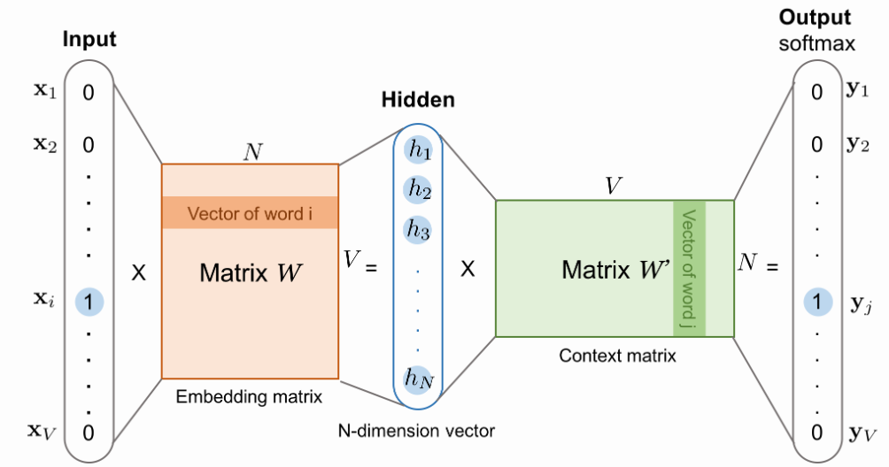
 

    * **Vai trò:** Biểu diễn các từ trong kho ngữ liệu dưới dạng các **vector số học dày đặc (dense vectors)** [14]. Các vector này có khả năng nắm bắt mối quan hệ ngữ nghĩa và cú pháp giữa các từ (ví dụ: vector("vua") - vector("đàn ông") + vector("phụ nữ") gần với vector("nữ hoàng")).
    * Chúng đóng vai trò quan trọng làm đầu vào cho nhiều mô hình Deep Learning, cung cấp biểu diễn ngữ nghĩa phong phú hơn so với các phương pháp đếm từ truyền thống [1, 14].

* **Document Embeddings (Doc2Vec / Paragraph Vectors):**
 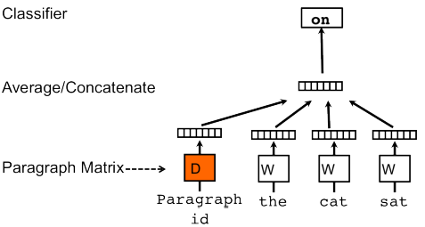

    * **Vai trò:** Mở rộng từ ý tưởng của Word2Vec, nhằm mục đích tạo ra một **vector biểu diễn duy nhất cho toàn bộ một đoạn văn bản hoặc tài liệu**, thay vì chỉ cho từng từ riêng lẻ [15]. Vector này cố gắng mã hóa ý nghĩa hoặc chủ đề tổng thể của văn bản.

* **Phương pháp DV-ngrams-cosine (Thongtan and Phienthrakul, 2019) [7]:**

    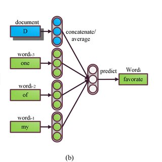

    * **Mô tả phương pháp:**
        * Đây là một cải tiến dựa trên kiến trúc Doc2Vec (Paragraph Vector) [15].
        * Điểm khác biệt chính là việc sử dụng **độ đo tương đồng cosine (cosine similarity)** thay cho phép nhân vô hướng (dot product) trong quá trình huấn luyện để học vector tài liệu [7].
        * Phương pháp này cũng tích hợp thông tin từ **n-grams** (các cụm từ gồm n từ liên tiếp) vào quá trình tạo vector [7].
    * **Kết quả ban đầu (đã được báo cáo nhưng sau đó được chứng minh là không chính xác):**
        * Trong bài báo gốc [7], khi kết hợp vector tài liệu DV-ngrams-cosine với vector Bag-of-N-grams được trọng số hóa bằng Naive Bayes (NB-weighted BON) và huấn luyện một bộ phân loại Logistic Regression, các tác giả đã báo cáo đạt độ chính xác lên tới **97.42%** trên bộ dữ liệu đánh giá phim IMDB.
        * **Lưu ý quan trọng:** Kết quả 97.42% này, mặc dù rất cao và từng được coi là state-of-the-art trên IMDB, nhưng sau đó đã được Zhang and Arefyev (2022) [6] phát hiện là **không chính xác** do lỗi trong quy trình đánh giá thử nghiệm. Kết quả thực tế của phương pháp này sau khi sửa lỗi được xác định là **93.68%** [6].

## 2.3. Phương pháp dựa trên Transformer

* **Giới thiệu:**
    * Các phương pháp này dựa trên kiến trúc **Transformer**, nổi bật với cơ chế **Self-Attention** [16].
    * Self-Attention cho phép mô hình đánh giá mức độ liên quan của tất cả các từ trong một câu khi xử lý một từ cụ thể, giúp nắm bắt hiệu quả các phụ thuộc ngữ nghĩa và ngữ pháp phức tạp, kể cả giữa các từ ở xa nhau [16].

* **Các mô hình phổ biến:**
    * **BERT** (Bidirectional Encoder Representations from Transformers) [17]: Huấn luyện dựa trên việc dự đoán các từ bị che (masked language model) và dự đoán câu tiếp theo (next sentence prediction), học được biểu diễn ngữ cảnh sâu sắc từ cả hai phía (trái và phải).
    * **RoBERTa** (A Robustly Optimized BERT Pretraining Approach): Cải tiến quy trình huấn luyện của BERT (dữ liệu lớn hơn, tối ưu hóa hyperparameters, loại bỏ nhiệm vụ dự đoán câu tiếp theo), thường cho kết quả tốt hơn BERT.
    * **XLNet** [18]: Một kiến trúc khác sử dụng phương pháp huấn luyện hoán vị (permutation-based) để nắm bắt phụ thuộc hai chiều.

* **Ứng dụng trong phân tích cảm xúc:**
    * Cách tiếp cận phổ biến là **fine-tuning**: Lấy một mô hình Transformer đã được **huấn luyện trước (pre-trained)** trên một kho dữ liệu văn bản khổng lồ (ví dụ: Wikipedia, BookCorpus) và tiếp tục huấn luyện (tinh chỉnh) nó trên bộ dữ liệu phân tích cảm xúc cụ thể [17]. Điều này giúp tận dụng "kiến thức" ngôn ngữ tổng quát mà mô hình đã học được.

* **Ví dụ và kết quả:**
    * **Kokab et al. (2022):** Đề xuất kiến trúc CBRNN (Convolutional Bi-directional Recurrent Neural Network) dựa trên **BERT (BERT-based CBRNN)**, đạt độ chính xác **93.00%** [8].
    * **Tan et al. (2022a):** Sử dụng mô hình lai kết hợp **RoBERTa và LSTM (RoBERTa-LSTM)**, đạt độ chính xác **92.96%** [9].
    * **Hiệu quả của RoBERTa:** Các mô hình Transformer như RoBERTa thường thể hiện **hiệu quả rất cao**, đặc biệt khi có sẵn **lượng dữ liệu huấn luyện lớn** [6]. Tuy nhiên, với các tập dữ liệu nhỏ hơn, hiệu quả của chúng có thể không vượt trội hoàn toàn so với các phương pháp khác [6, 7].

* **Đánh giá:**
    * **Ưu điểm:** Thường xuyên đạt được **hiệu suất hàng đầu (state-of-the-art)** trên nhiều bài toán NLP, bao gồm phân tích cảm xúc, nhờ khả năng **nắm bắt ngữ cảnh sâu sắc và các mối quan hệ phức tạp** trong ngôn ngữ [16, 17].
    * **Nhược điểm:** Các mô hình Transformer thường rất lớn và phức tạp, đòi hỏi **nhiều tài nguyên tính toán** (GPU, bộ nhớ) và thời gian cho việc huấn luyện và fine-tuning [6, 16].

## 2.4. Phương pháp Ensemble Learning

* **Khái niệm:** Ensemble Learning là một kỹ thuật trong học máy, nơi **kết quả dự đoán từ nhiều mô hình riêng lẻ (base models) được kết hợp lại** để đưa ra một dự đoán cuối cùng duy nhất. Mục đích chính là để **cải thiện độ chính xác, độ ổn định và khả năng khái quát hóa** so với việc chỉ sử dụng một mô hình đơn lẻ. Có nhiều cách để kết hợp, ví dụ như lấy trung bình, bỏ phiếu đa số, hoặc huấn luyện một meta-model.

### Ví dụ 1: Ensemble các mô hình Transformer lai (Tan et al., 2022b) [10]

* **Mô hình:** Các tác giả đề xuất một mô hình ensemble bằng cách kết hợp dự đoán từ ba mô hình lai khác nhau, tất cả đều dựa trên RoBERTa nhưng kết hợp với các kiến trúc RNN khác nhau:
    1.  RoBERTa + LSTM
    2.  RoBERTa + BiLSTM
    3.  RoBERTa + GRU
* **Kết quả:** Bằng cách kết hợp điểm mạnh của từng biến thể, mô hình ensemble này đã đạt được độ chính xác **94.9%**, cao hơn so với các mô hình thành phần khi đứng riêng lẻ [10].

### Ví dụ 2: Ensemble DV-ngrams-cosine + NB-weighted BON (Thongtan and Phienthrakul, 2019 [7] - với sự điều chỉnh từ Zhang and Arefyev, 2022 [6])

* **Mô tả Ensemble (trong bài báo gốc [7]):** Mô hình được Thongtan and Phienthrakul báo cáo đạt 97.42% là một dạng ensemble đơn giản, kết hợp đầu ra (logits) từ hai nguồn đặc trưng khác nhau trước khi đưa vào lớp Logistic Regression cuối cùng:
    1.  Đặc trưng từ vector tài liệu **DV-ngrams-cosine**.
    2.  Đặc trưng từ **Bag-of-N-grams được trọng số hóa bằng Naive Bayes (NB-weighted BON)**.
* **Phân tích sai sót và đánh giá lại (từ Zhang and Arefyev, 2022 [6]):**
    * **Phát hiện lỗi nghiêm trọng:** Nghiên cứu của Zhang and Arefyev (2022) [6] đã chỉ ra một **lỗi trong quy trình đánh giá** của bài báo gốc [7]. Cụ thể, khi tạo vector đặc trưng cuối cùng cho bộ phân loại Logistic Regression trong tập kiểm tra, tác giả gốc đã **ghép nhầm (concatenate) vector DV-ngrams-cosine của một tài liệu với vector NB-weighted BON của một tài liệu *khác*** (mặc dù cùng lớp cảm xúc dương/âm). Quy trình đúng là phải ghép nối các vector đặc trưng được trích xuất từ *cùng một* tài liệu [6].
    * **Kết quả thực tế sau khi sửa lỗi:** Sau khi thực hiện lại thí nghiệm với quy trình ghép nối chính xác, độ chính xác của mô hình ensemble này trên bộ dữ liệu IMDB là **93.68%** [6].
    * **Đánh giá lại hiệu quả Ensemble:** Kết quả 93.68% này **chỉ cao hơn không đáng kể** so với độ chính xác khi chỉ sử dụng thành phần DV-ngrams-cosine một mình (là 93.13%, cũng được tính toán lại sau khi sửa lỗi bởi [6]). Điều này cho thấy, trái ngược với kết luận ban đầu dựa trên kết quả sai, việc thêm NB-weighted BON vào ensemble thực tế **không mang lại lợi ích đáng kể** cho hiệu suất mô hình trên bộ dữ liệu này [6].

# 4. Thảo luận và Hướng nghiên cứu tương lai (Discussion and Future Work)
## 4.1 Hướng nghiên cứu tương lai đề xuất (Proposed Future Research Directions)

### 4.1.1. Áp dụng Hard Negative Sampling cho Huấn luyện Document/N-gram Embeddings

* **Bối cảnh và Hạn chế của Phương pháp Hiện tại:**
    * Nhiều phương pháp huấn luyện embedding cho từ, n-gram hoặc văn bản, bao gồm word2vec [14], doc2vec (Paragraph Vectors) [15], và các phương pháp dựa trên Doc2Vec như DV-ngrams-cosine [7], thường dựa trên kỹ thuật *Negative Sampling* [14]. Kỹ thuật này huấn luyện mô hình phân biệt giữa mẫu "dương" (ví dụ: một n-gram thực sự có trong văn bản) và các mẫu "âm" được chọn ngẫu nhiên từ kho dữ liệu (ví dụ: các n-grams không có trong văn bản đó).
    * Việc lựa chọn các mẫu âm một cách hoàn toàn *ngẫu nhiên* có thể dẫn đến việc hầu hết các mẫu âm quá "dễ" để mô hình phân biệt. Điều này có nghĩa là mô hình có thể hội tụ nhanh nhưng không học được các đặc trưng đủ tinh vi để phân biệt giữa các thực thể (từ/n-gram/văn bản) có ngữ nghĩa gần giống nhau nhưng khác biệt quan trọng.

* **Đề xuất Hard Negative Sampling:**
    * **Ý tưởng cốt lõi:** Thay vì chọn mẫu âm ngẫu nhiên, chúng ta nên tập trung vào việc chọn các mẫu âm "khó" (Hard Negatives). Đây là những mẫu âm mà mô hình *dễ bị nhầm lẫn* với mẫu dương. Trong không gian embedding, đây thường là những mẫu có vector biểu diễn *gần* với vector của mẫu dương nhưng lại thuộc về một lớp khác hoặc không có mối liên hệ ngữ nghĩa thực sự.
    * **Cách tiếp cận (Gợi ý):**
        1.  **Trong quá trình huấn luyện:** Đối với một mẫu dương (anchor document/n-gram), tính toán độ tương đồng (ví dụ: cosine similarity) với một tập hợp các ứng viên mẫu âm tiềm năng.
        2.  **Lựa chọn Hard Negatives:** Chọn ra những mẫu âm có độ tương đồng cao nhất với mẫu dương nhưng vẫn đảm bảo chúng là "âm" thực sự (ví dụ: n-gram không thuộc văn bản gốc, hoặc văn bản thuộc lớp cảm xúc khác). Có thể kết hợp cả mẫu âm ngẫu nhiên và mẫu âm "khó" để cân bằng.
        3.  **Cập nhật mô hình:** Sử dụng các cặp (dương, âm khó) này để cập nhật tham số của mô hình, buộc mô hình phải đẩy embedding của mẫu âm khó ra xa mẫu dương.
    * **Mục tiêu:**
        * Tăng cường khả năng phân biệt của mô hình đối với các trường hợp khó, tinh chỉnh ranh giới quyết định trong không gian embedding.
        * Học được các biểu diễn vector (embeddings) chất lượng cao hơn, nắm bắt tốt hơn các sắc thái ngữ nghĩa và cảm xúc tinh tế.
    * **Tiềm năng và Thách thức:**
        * *Tiềm năng:* Việc sử dụng Hard Negative Sampling hứa hẹn cải thiện đáng kể chất lượng của document và n-gram embeddings, từ đó nâng cao hiệu suất của các mô hình phân loại cảm xúc hoặc các tác vụ NLP khác sử dụng các embeddings này.
        * *Thách thức:* Việc tìm kiếm và lựa chọn các mẫu âm "khó" một cách hiệu quả có thể làm tăng chi phí tính toán trong quá trình huấn luyện. Cần thiết kế các thuật toán hoặc chiến lược lấy mẫu thông minh để cân bằng giữa hiệu quả và chi phí.

* **Kết nối với Nghiên cứu Hiện tại:** Kỹ thuật Hard Negative Sampling đã được áp dụng thành công trong các lĩnh vực khác như nhận dạng hình ảnh (Face Recognition), Metric Learning, và Recommender Systems. Việc áp dụng và điều chỉnh kỹ thuật này cho bài toán huấn luyện document/n-gram embeddings trong NLP, đặc biệt là cho phân tích cảm xúc, là một hướng đi đầy hứa hẹn.

### 4.1.2. Cải tiến NB Sub-Sampling dựa trên Đặc trưng Lớp và Tần suất N-gram

* **Phương pháp NB Sub-Sampling gốc và Hạn chế:**
    * Kỹ thuật NB Sub-Sampling được áp dụng trong [7] (và được phân tích trong [6]) sử dụng trọng số Naive Bayesian $h_i$ để đánh giá mức độ quan trọng của n-gram $f_i$. Trọng số này dựa trên sự khác biệt log-probability giữa các lớp (dựa trên nguyên tắc từ Manning and Schütze, 1999):
      $$h_i = |log~p(f_i|y=1) - log~p(f_i|y=0)|$$
    * Xác suất $p(f_i)$ để giữ lại n-gram $f_i$ trong quá trình huấn luyện được xác định bởi công thức (dựa trên nguyên tắc từ Levy et al., 2015 và áp dụng trong [7, 6]):
      $$p(f_i) = min(exp(h_i/n_a) / n_b, 1)$$
      trong đó $n_a$ và $n_b$ là các siêu tham số.
    * *Hạn chế tiềm ẩn* của việc áp dụng này [6, 7]:
        1.  **Thiếu yếu tố Tần suất:** Công thức trên không trực tiếp xem xét tần suất xuất hiện $freq(f_i)$ của n-gram. Điều này có nghĩa là các n-grams rất phổ biến hoặc rất hiếm có thể có cùng xác suất lấy mẫu như các n-grams có tần suất trung bình.
        2.  **Mất thông tin về Hướng:** Việc sử dụng giá trị tuyệt đối $|...|$ trong $h_i$ làm mất thông tin về việc n-gram $f_i$ đặc trưng mạnh hơn cho lớp nào.

* **Đề xuất Cải tiến:**
    * **Ý tưởng cốt lõi:** Điều chỉnh xác suất lấy mẫu $p(f_i)$ để phản ánh không chỉ khả năng phân biệt lớp ($h_i$) mà còn cả tần suất xuất hiện ($freq(f_i)$) và đặc trưng riêng của $f_i$ đối với từng lớp.
    * **Tích hợp Nhận thức về Tần suất (Frequency-Awareness):**
        * **Mục tiêu:** Giảm xác suất lấy mẫu cho các n-grams quá phổ biến hoặc quá hiếm.
        * **Cách tiếp cận:** Giới thiệu một hàm trọng số $w(freq(f_i))$ phụ thuộc vào tần suất. Hàm này nên có giá trị thấp khi $freq(f_i)$ rất cao hoặc rất thấp, và giá trị cao hơn trong khoảng tần suất trung bình. Ví dụ, có thể lấy cảm hứng từ các kỹ thuật sub-sampling trong word2vec [14] hoặc sử dụng một hàm giảm nhẹ dựa trên $freq(f_i)$.
    * **Phân tích Đặc trưng theo Lớp (Class-Specific Characterization):**
        * **Mục tiêu:** Có thể ưu tiên các n-grams là "dấu hiệu mạnh" cho một lớp cụ thể, không chỉ những n-gram có sự khác biệt lớn nhất.
        * **Cách tiếp cận:** Thay vì chỉ dùng $h_i$, xem xét trực tiếp các giá trị $log~p(f_i|y=1)$ và $log~p(f_i|y=0)$. Ví dụ, có thể thiết kế một chiến lược ưu tiên các n-grams có $log~p(f_i|y=1) \gg log~p(f_i|y=0)$ hoặc ngược lại, kết hợp với điều kiện về $h_i$ và tần suất.
    * **Công thức Lấy mẫu Cải tiến (Ví dụ Đề xuất):**
        Một cách tiếp cận là điều chỉnh trực tiếp xác suất $p(f_i)$ bằng hàm trọng số tần suất $w(freq(f_i))$:
        $$p'(f_i) = min( \frac{exp(h_i/n_a)}{n_b} \cdot w(freq(f_i)), 1)$$
        Trong đó $w(freq(f_i))$ là hàm trọng số tần suất được thiết kế phù hợp (ví dụ: $w(freq(f_i)) \propto 1 / \sqrt{freq(f_i) + \epsilon}$ hoặc một hàm phức tạp hơn). Việc kết hợp phân tích đặc trưng theo lớp có thể yêu cầu một công thức phức tạp hơn hoặc một quy trình lấy mẫu nhiều giai đoạn.

* **Kỳ vọng:**
    * Việc tích hợp yếu tố tần suất và đặc trưng lớp vào NB Sub-Sampling được kỳ vọng sẽ tạo ra một cơ chế chọn lọc n-gram hiệu quả hơn, tập trung vào những n-gram "chất lượng" nhất cho việc học embedding.
    * Điều này có thể dẫn đến việc huấn luyện các vector embedding ổn định hơn, giàu thông tin hơn và cuối cùng là cải thiện hiệu suất của mô hình phân loại cảm xúc, đặc biệt trên các tập dữ liệu có nhiễu hoặc phân bố từ vựng không đồng đều.

* *... (Phần 4.3.3 và các phần thảo luận khác sẽ được bổ sung) ...*

# Tài liệu tham khảo

[1] Maas, A. L., Daly, R. E., Pham, P. T., Huang, D., Ng, A. Y., & Potts, C. (2011, June). Learning word vectors for sentiment analysis. In *Proceedings of the 49th annual meeting of the Association for Computational Linguistics: Human language technologies* (pp. 142-150).

[2] Iqbal, N., Chowdhury, A. M., & Ahsan, T. (2018, February). Enhancing the performance of sentiment analysis by using different feature combinations. In *2018 International Conference on Computer, Communication, Chemical, Material and Electronic Engineering (IC4ME2)* (pp. 1-4). IEEE.

[3] Dholpuria, T., Rana, Y., & Agrawal, C. (2018, November). A sentiment analysis approach through deep learning for a movie review. In *2018 8th International Conference on Communication Systems and Network Technologies (CSNT)* (pp. 173-181). IEEE.

[4] Thinh, N. K., Nga, C. H., Lee, Y. S., Wu, M. L., Chang, P. C., & Wang, J. C. (2019, December). Sentiment Analysis Using Residual Learning with Simplified CNN Extractor. In *2019 IEEE International Symposium on Multimedia (ISM)* (pp. 335-3353). IEEE.

[5] Jang, B., Kim, M., Harerimana, G., Kang, S. U., & Kim, J. W. (2020). Bi-LSTM model to increase accuracy in text classification: Combining Word2vec CNN and attention mechanism. *Applied Sciences*, *10*(17), 5841.

[6] Zhang, B., & Arefyev, N. (2022). The Document Vectors Using Cosine Similarity Revisited. *arXiv preprint arXiv:2205.13357*.

[7] Thongtan, T., & Phienthrakul, T. (2019, July). Sentiment classification using document embeddings trained with cosine similarity. In *Proceedings of the 57th Annual Meeting of the Association for Computational Linguistics: Student Research Workshop* (pp. 407-414).

[8] Kokab, S. T., Asghar, S., & Naz, S. (2022). Transformer-based deep learning models for the sentiment analysis of social media data. *Array*, *14*, 100157.

[9] Tan, K. L., Lee, C. P., Anbananthen, K. S. M., & Lim, K. M. (2022). ROBERTa-LSTM: A hybrid model for sentiment analysis with transformer and recurrent neural network. *IEEE Access*, *10*, 21517-21525. (Tan et al., 2022a)

[10] Tan, K. L., Lee, C. P., Lim, K. M., & Anbananthen, K. S. M. (2022). Sentiment Analysis with Ensemble Hybrid Deep Learning Model. *IEEE Access*, *10*, 103694-103704. (Tan et al., 2022b)

[11] AlBadani, B., Shi, R., Dong, J., Al-Sabri, R., & Moctard, O. B. (2022). Transformer-based graph convolutional network for sentiment analysis. *Applied Sciences*, *12*(3), 1316.

[12] Graves, A. (2013). Generating sequences with recurrent neural networks. *arXiv preprint arXiv:1308.0850*. (Lưu ý: Tham chiếu này thường dùng cho sequence generation, LSTM gốc là của Hochreiter & Schmidhuber, 1997)

[13] Cho, K., Van Merriënboer, B., Gulcehre, C., Bahdanau, D., Bougares, F., Schwenk, H., & Bengio, Y. (2014). Learning phrase representations using RNN encoder-decoder for statistical machine translation. *arXiv preprint arXiv:1406.1078*.

[14] Mikolov, T., Chen, K., Corrado, G., & Dean, J. (2013). Efficient estimation of word representations in vector space. *arXiv preprint arXiv:1301.3781*.

[15] Le, Q., & Mikolov, T. (2014, June). Distributed representations of sentences and documents. In *International conference on machine learning* (pp. 1188-1196). PMLR.

[16] Vaswani, A., Shazeer, N., Parmar, N., Uszkoreit, J., Jones, L., Gomez, A. N., ... & Polosukhin, I. (2017). Attention is all you need. *Advances in neural information processing systems*, *30*.

[17] Devlin, J., Chang, M. W., Lee, K., & Toutanova, K. (2018). Bert: Pre-training of deep bidirectional transformers for language understanding. *arXiv preprint arXiv:1810.04805*.

[18] Yang, Z., Dai, Z., Yang, Y., Carbonell, J., Salakhutdinov, R. R., & Le, Q. V. (2019). Xlnet: Generalized autoregressive pretraining for language understanding. *Advances in neural information processing systems*, *32*.