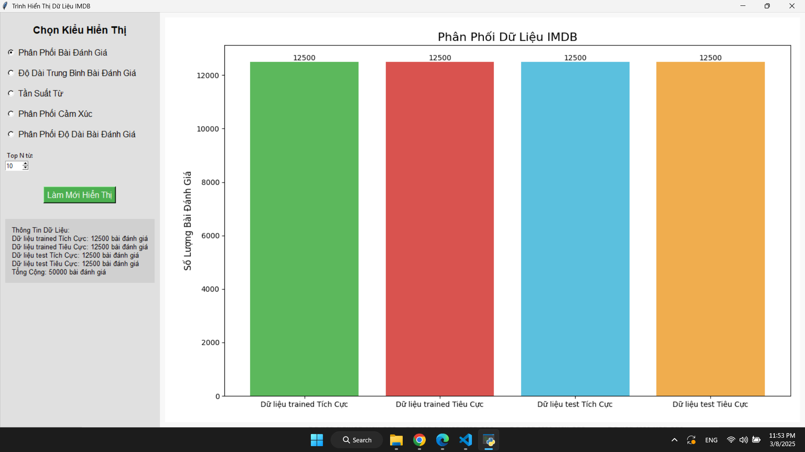
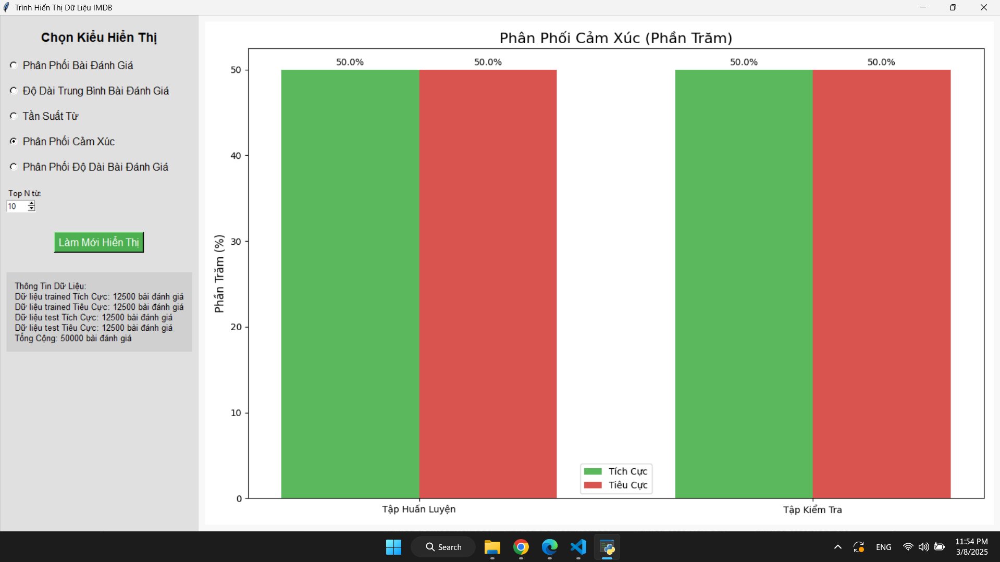
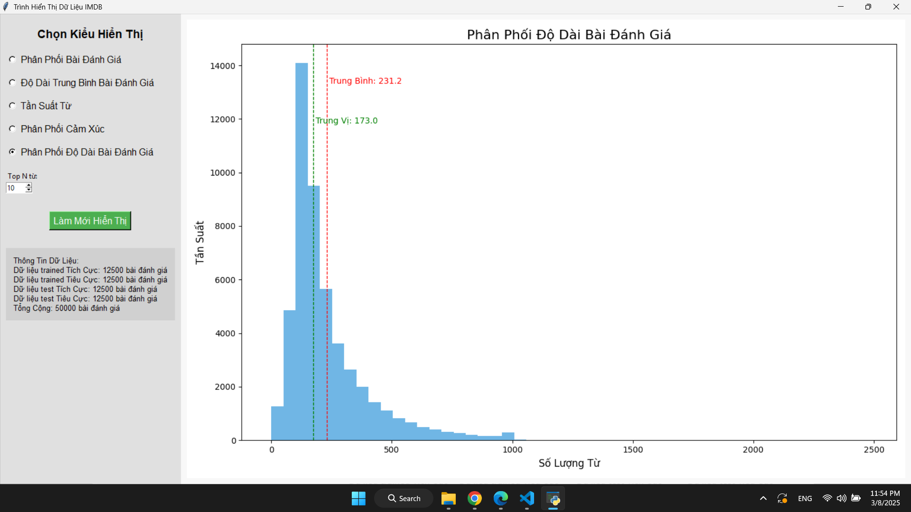

# Hướng dẫn chạy phần mềm

## Yêu cầu hệ thống
- Python 3.8.0
- Các thư viện cần thiết (có thể cài đặt từ file `requirements.txt`)

## Cài đặt
1. Mở terminal hoặc command prompt.
2. Điều hướng đến thư mục chứa file `main.py`.

## Cài đặt các thư viện cần thiết
Cài đặt các thư viện cần thiết trước khi chạy phần mềm:
```bash
pip install -r requirements.txt
```

## Chạy phần mềm
```bash
python main.py
```

## Hình ảnh minh họa
*Mô tả hình ảnh: Đây là hình ảnh minh họa cho giao diện chính của phần mềm.*




