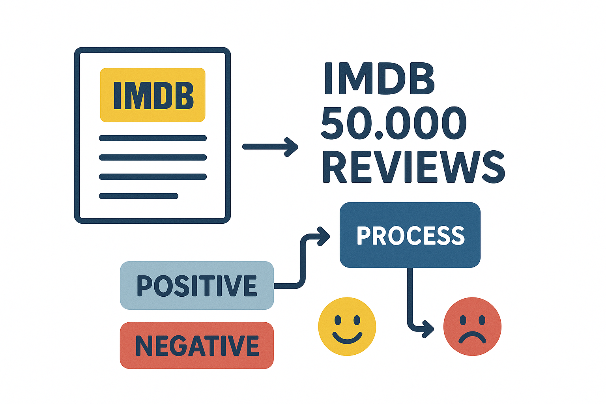
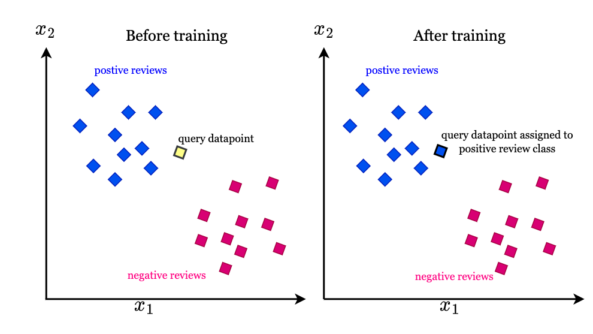
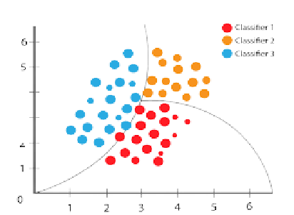

# THÔNG TIN NHÓM

|Tên                                |MSSV      |Portfolio         |Email|
|-----------------------------------|  :----:  |------------------|-----|
|Nguyễn Phan Tuấn Kiệt (Trưởng nhóm)|3122410193|[https://kietng04.github.io/portfolio/](https://kietng04.github.io/portfolio/) |nguyenphantuankiet299@gmail.com|
|Nguyễn Thế Kiên                    |3122410194|[https://tkieen.github.io/PersonalWebsite/](https://tkieen.github.io/PersonalWebsite/) |nguyenthekien62@gmail.com|
|Phạm Văn Kiệt                      |3122410200|[https://vankiet04.github.io/portfolio/](https://vankiet04.github.io/portfolio) |pvk210504@gmail.com|

# PHÂN TÍCH CẢM XÚC ĐÁNH GIÁ PHIM SỬ DỤNG PHƯƠNG PHÁP ENSEMBLE

## 1. Tên đề tài
Phân tích cảm xúc đánh giá phim sử dụng phương pháp Ensemble

## 2. Lý do chọn đề tài

- **Thách thức trong phân tích cảm xúc văn bản**: Phân tích cảm xúc văn bản gặp nhiều khó khăn khi xử lý cấu trúc ngôn ngữ phức tạp như phủ định, mỉa mai, và biểu đạt cảm xúc tinh tế.

- **Hạn chế của mô hình đơn lẻ**: Các mô hình transformer lớn như BERT, XLNet đạt hiệu suất cao nhưng đòi hỏi tài nguyên tính toán lớn và dữ liệu huấn luyện khổng lồ.

- **Tiềm năng của phương pháp ensemble**: Phương pháp kết hợp có khả năng tận dụng điểm mạnh của nhiều mô hình khác nhau để nâng cao hiệu suất phân loại.

- **Ứng dụng thực tiễn rộng rãi**: Kết quả nghiên cứu có thể ứng dụng trong nhiều lĩnh vực như gợi ý nội dung, giám sát thương hiệu và phân tích phản hồi khách hàng.

- **Cân bằng giữa hiệu suất và hiệu quả tài nguyên**: Phương pháp ensemble giúp tối ưu hóa hiệu suất mà không đòi hỏi tăng đáng kể chi phí tính toán.

## 3. Dataset
- Bộ dữ liệu IMDB Reviews
- Quy mô: 50.000 đánh giá phim (25.000 huấn luyện, 25.000 kiểm tra)
- Phân phối cân bằng: 50% tích cực, 50% tiêu cực
- Nguồn: Andrew L. Maas và cộng sự (2011), bài báo "Learning word vectors for sentiment analysis" tại Hội nghị ACL-HLT 2011
- Đặc điểm: Độ dài trung bình khoảng 231 từ/đánh giá, phong phú về cấu trúc ngôn ngữ và biểu đạt cảm xúc

## 4. Input/Output
- **Input**: Đánh giá phim từ IMDB (văn bản)
- **Output**: Phân loại nhị phân: Tích cực (1) hoặc Tiêu cực (0)

## 5. Mô hình sử dụng
- **Mô hình đơn lẻ**: 
  * Logistic Regression

  

  * K-Nearest Neighbors (KNN)
  
  

  * Naive Bayes

  
  
- **Phương pháp ensemble**: 
  * Hard Voting (bỏ phiếu cứng)
  * Soft Voting (bỏ phiếu mềm)
  
- **Đặc trưng sử dụng**:
  * Đặc trưng văn bản được trọng số hóa bằng Naive Bayes
  * Kết hợp với vector embedding

## 6. Độ đo đánh giá
- **Độ chính xác (Accuracy)**: Tỉ lệ phần trăm các dự đoán đúng
- **F1-score**: Trung bình điều hòa của Precision và Recall
- **Phân tích định tính**: Đánh giá khả năng xử lý các trường hợp ngôn ngữ phức tạp

## 7. Các bước thực hiện nghiên cứu
1. **Thu thập và tiền xử lý dữ liệu**:
   - Chuẩn hóa văn bản đánh giá phim
   - Trích xuất đặc trưng n-gram
   - Kết hợp với vector embedding

2. **Xây dựng mô hình đơn lẻ**:
   - Huấn luyện các mô hình Logistic Regression, KNN và Naive Bayes
   - Đánh giá hiệu suất từng mô hình riêng lẻ

3. **Triển khai các phương pháp ensemble**:
   - Thiết kế và triển khai Hard Voting
   - Thiết kế và triển khai Soft Voting
   - Tối ưu hóa quy trình kết hợp dự đoán

4. **Đánh giá và phân tích kết quả**:
   - So sánh hiệu suất giữa các mô hình đơn lẻ và phương pháp ensemble
   - Phân tích chi tiết các trường hợp phức tạp
   - Đánh giá khả năng ứng dụng thực tế

## 8. Kết quả dự kiến
- So sánh toàn diện hiệu suất giữa các mô hình đơn lẻ và phương pháp ensemble
- Phân tích ưu và nhược điểm của Hard Voting và Soft Voting trong phân tích cảm xúc
- Đánh giá khả năng xử lý các trường hợp ngôn ngữ phức tạp của phương pháp ensemble
- Đề xuất cải tiến và hướng phát triển tương lai

# SCHEDULE
**[Google Sheets](https://docs.google.com/spreadsheets/d/1Q9h6LFw36fSQiCDfojJd62I6kkspTYdbZtQn_GCc1Zs/edit?usp=sharing)**

